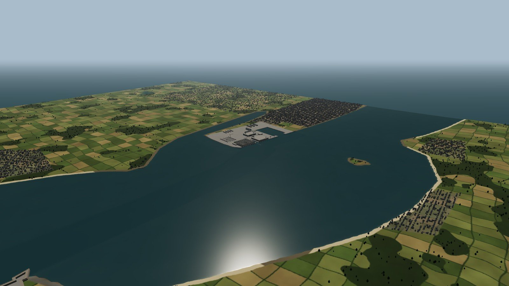
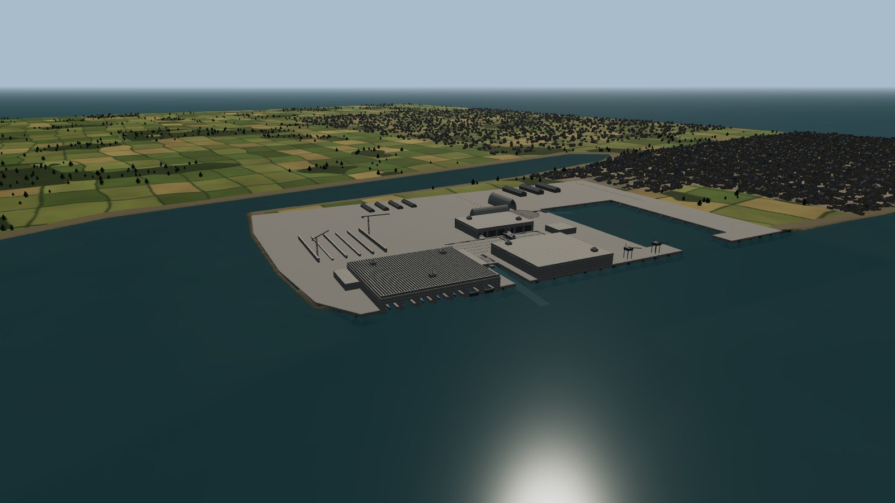
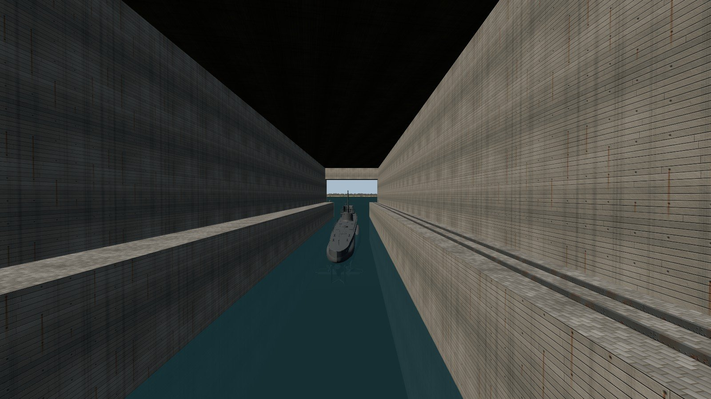
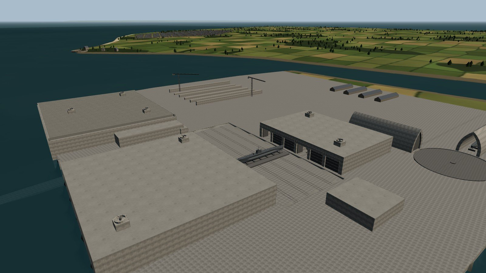
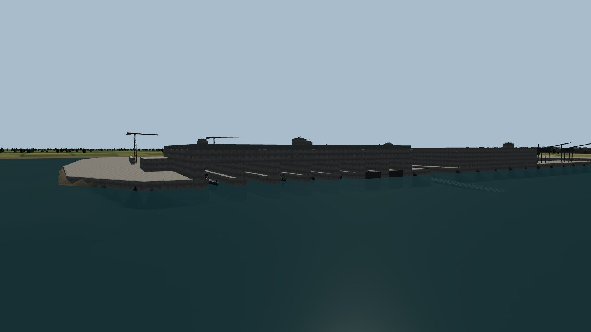
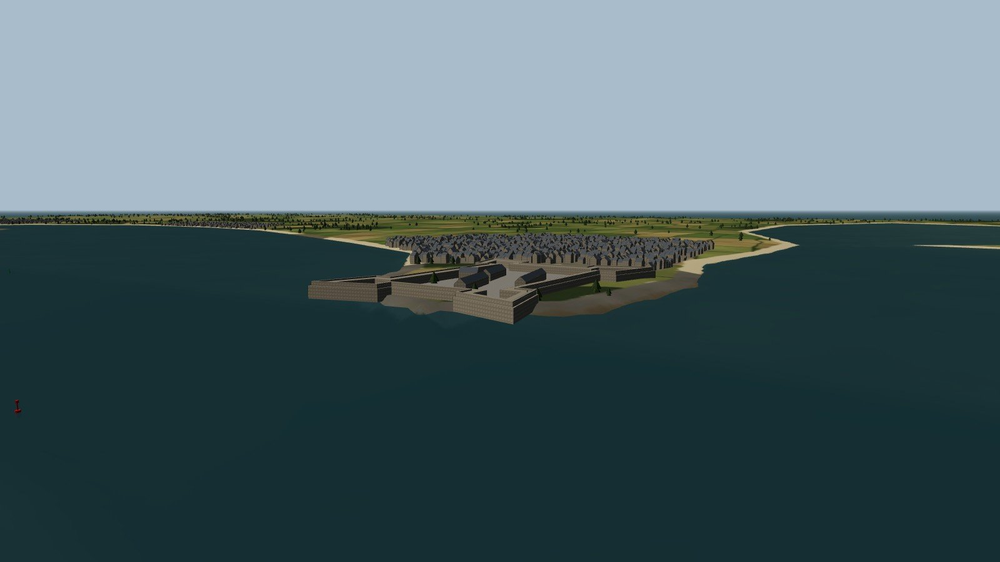

# Lorient — base de Keroman, fin 1943

Nouvelle carte jouable **/Game/Lorient/LorientKeroman** : le VIIC appareille de l’alvéole 4 de Keroman III, sort dans la rade de Lorient, passe sous la citadelle de Port-Louis et plonge au large de Gâvres. Mêmes commandes que la version d’exploration ([JOUER.md](JOUER.md)). AtlanticVoyage, AtlanticCoast, AtlanticDemo et la scène Bismarck ne sont pas modifiées.



> Les images de cette page sont des **rendus de contrôle WebGL** (three.js) des fichiers générés, sans l’éclairage, l’eau ni les matériaux d’Unreal. Elles ne remplacent pas une capture dans le moteur.

## Construire la carte (une fois)

La carte n’existe pas encore sous forme `.umap` dans le dépôt : elle se construit sur le Mac, dans l’éditeur complet, à partir des fichiers de `Import/Lorient`.

1. Compiler le module C++ (commande du [README](../README.md)) : la carte utilise le mode de jeu Voyage, étendu pour Lorient.
2. Fermer tout éditeur Unreal, puis lancer `Tools/build-lorient.sh`. L’éditeur s’ouvre deux fois et se ferme seul :
   - `build_lorient.py` copie AtlanticVoyage (VIIC, flottabilité, océan, ciel) vers `/Game/Lorient/LorientKeroman` ;
   - `populate_lorient.py` retire l’île fictive, l’épave, la balise et le Bismarck, puis importe le décor, crée les matériaux, place le VIIC dans son alvéole et les autres U-Boote, et règle l’eau.
3. Contrôler la fin du journal `Saved/Logs/Lorient-populate.log` : `LORIENT_MAP_BUILT`. Le script s’arrête avec une erreur explicite si un maillage arrive avec de mauvais axes.

Ensuite : **Jouer-a-Lorient.command** (jeu) ou **Ouvrir-Lorient.command** (éditeur). Le lanceur signale si la carte n’est pas encore construite.

## Objectifs

| # | Objectif | Où |
|---|---|---|
| 1 | Appareillage : sortir de l’alvéole K3 | 250 m devant Keroman III, en surface |
| 2 | Passe de Port-Louis, sous la citadelle | chenal dragué, 12,5 m d’eau |
| 3 | Plongée d’essai au large de Gâvres | 5,3 km au sud, à 20 m de profondeur (26 m d’eau) |

La carte en bas à gauche couvre 3 km de rayon. La zone de jeu fait 4,2 km de rayon autour de la rade. Sauvegarde distincte : `Saved/SaveGames/NordatlantikLorient_v1.sav`. **Home** ramène le bateau dans son alvéole.

Le chenal est dragué à 9,5–12,5 m jusqu’à la passe. Hors chenal, la rade n’a que 3 à 6 m d’eau, et la protection contre le fond arrête les moteurs. Plonger n’est possible qu’au large.

## Ce qui est représenté



**Keroman III (K3)** : 138 × 170 m, 20 m au-dessus du quai, sept alvéoles à flot de 19,5 m, murs de refend de 3,6 m, murs extérieurs de 6 m. Toit de 7,4 m : dalle de 4,2 m surmontée de la grille de poutres anti-bombes (*Fangrost*), en saillie de 4 m au-dessus de l’eau. Quais de travail dans chaque alvéole. Les deux alvéoles nord sont des formes de radoub, représentées en eau derrière leur bateau-porte. Tours de Flak de 2 cm sur le toit, extensions nord-est et sud-ouest.



**Keroman I et II, slipway et transbordeur** : K1 (119,5 × 85 × 18,5 m, toit de 3,5 m, cinq alvéoles et la nef couverte du slip) et K2 (128 × 138 × 18,5 m, sept alvéoles plus K6A) se font face de part et d’autre de la fosse du transbordeur (*Schiebebühne*). Le slipway descend de la fosse à −10,65 m dans la rade. Le chariot porte un VIIC sur son ber, d’autres sont en carénage dans les alvéoles ouvertes. Les portes blindées des autres alvéoles sont fermées. Rails, treuil, grues portiques.



**Port de pêche et Dombunker** : deux abris « cathédrale » (T5, T6) de 81 m de long, 16 m de portée et 25 m de haut, en voûte brisée, desservis par la plaque tournante et le slip du port de pêche. Un VIIC est abrité sous T5, portes ouvertes.

**Chantier de K4** : fondations et grues à tour. Son emplacement est schématique.



**Rade** : citadelle de Port-Louis (tracé bastionné, ravelin, casernes, chapelle), ville de Port-Louis, Kernével et les villas du PC de Dönitz, île Saint-Michel et sa chapelle, Locmiquélic, Sainte-Catherine, Gâvres et la Petite Mer, Larmor, balises rouges et vertes du chenal, île de Groix au loin.

Lorient apparaît largement en ruine : les bombardements de janvier et février 1943 ont détruit l’essentiel de la ville. Environ 13 000 maisons sont générées : granit sous ardoise, ou murs éventrés sans toit.



## Fidélité et limites

- **Cotes des blocs** : d’après les mesures publiées (voir Sources). L’espacement entre les blocs, la position du chantier K4 et l’orientation exacte des Dombunker sont des estimations cohérentes avec les descriptions fonctionnelles (slipway → transbordeur → alvéoles à sec de K1/K2 ; K3 accessible directement depuis l’eau).
- **Géographie** : trait de côte, profondeurs et positions (Port-Louis, Kernével, Saint-Michel, Gâvres) tracés d’après la disposition générale de la rade, **pas d’après un relevé**. Les services de cartes (OpenStreetMap, IGN, SHOM) et les archives photographiques (Wikimedia Commons, Inventaire du patrimoine de Bretagne) n’étaient pas accessibles depuis l’environnement de construction. Recaler la carte sur ces données est la prochaine étape vers une rade exacte.
- **Photos et plans** : aucune photographie n’est intégrée comme texture. Les textures sont **générées** d’après les caractéristiques documentées : béton banché à planches horizontales avec trous de tiges et coulures de rouille, toit rugueux à lichens, pavés de granit, tôles rivetées, moellons de granit breton, ardoise. Elles se raccordent sans couture.
- **Unreal non exécuté ici** : les scripts Unreal et le C++ ont été écrits sans éditeur ni compilateur Unreal disponibles. Ils suivent les méthodes déjà validées dans ce projet (import OBJ, matériaux, réparation de l’eau). Vérifications faites hors moteur :
  - dimensions et orientation des maillages (le script d’import refuse un résultat décalé de plus de 1,5 m) ;
  - `Tests/lorient-navigation.py` : il rejoue la logique de sécurité du pawn (`SafeAt`) sur les maillages de collision générés. Départ dans l’alvéole sûr, route de l’alvéole à la zone de plongée sûre sur 941 points, plongée à 20 m possible, citadelle et murs d’alvéole bloquants, constantes C++ identiques au `layout.json`.
- **Eau** : l’océan Gerstner traverse les ouvrages. La houle de la rade est adoucie (amplitudes × 0,35, longueurs d’onde × 0,6 dans une copie de l’asset d’Epic), mais un léger clapot existe aussi dans les alvéoles. Si ce réglage échoue, le journal indique `WAVES_KEPT` et la houle d’origine reste en place. Pas de marée : le niveau est la mi-marée.
- **Collisions** : décor en requêtes seules sur ses triangles réels, comme AtlanticVoyage. Le bateau est arrêté par la protection de navigation, pas par un choc physique.
- Pas de trafic, de personnages, de filets anti-torpilles ni de camouflage des toits. L’essai automatique `-VoyageSmokeTest` sur cette carte démarre au large (la plongée exige de l’eau profonde).

## Régénérer les fichiers

```bash
pip install numpy scipy pillow shapely mapbox_earcut
python3 UnrealDemo/Tools/generate-lorient.py      # environ 4 minutes
pip install trimesh rtree
python3 UnrealDemo/Tests/lorient-navigation.py
```

- `Tools/lorient/geography.py` : cotes des blocs, implantation de la base (repère tourné de 10°, origine sur le quai de K3), trait de côte, chenal, villes. C’est le fichier à corriger pour recaler la géographie.
- `terrain.py` : relief et bathymétrie (grille de 25 m, 5 m autour de la base), carte d’occupation du sol 4096².
- `structures.py` : ouvrages, maisons, arbres, balises.
- `textures.py` : textures PBR.
- `meshkit.py` : écriture OBJ.
- Sorties : `Import/Lorient/*.obj`, `Textures/`, `layout.json`, `generation-report.json`.

Si `layout.json` change (départ, objectifs), reporter les valeurs dans `FVoyageMission::ForMap` (`Source/NordatlantikDemo/Voyage.cpp`) : le test de navigation vérifie la concordance. Pour reconstruire la carte, supprimer `Content/Lorient` et relancer `Tools/build-lorient.sh`.

Aperçus sans Unreal : `Tools/lorient/preview.html` et `preview-shoot.mjs` (three.js dans Chromium, mode d’emploi en tête du fichier HTML).

| Maillage | Triangles |
|---|---|
| Terrain et fonds | 380 288 |
| Maçonnerie (villes, ruines, citadelle) | ≈ 317 000 |
| Ardoises | ≈ 42 000 |
| Arbres | ≈ 47 000 |
| Béton, toits, quais, acier de Keroman | ≈ 8 000 |
| VIIC placés (en plus du bateau joué) | 13 instances du modèle détaillé |

Nanite est activé sur les maillages volumineux (terrain, villes, arbres) si la version d’Unreal l’accepte ; sinon le journal le signale. Les performances en jeu sur le Mac M4 restent à mesurer.

## Sources

- [uboat.net — Lorient bunkers](https://uboat.net/flotillas/bases/lorient_bunkers.htm) : dimensions de K1, K2, K3, alvéoles, toits.
- [Base sous-marine de Lorient — Wikipédia](https://fr.wikipedia.org/wiki/Base_sous-marine_de_Lorient) et [Lorient Submarine Base](https://en.wikipedia.org/wiki/Lorient_Submarine_Base).
- [Patrimoine de Lorient — base de Keroman](https://patrimoine.lorient.bzh/histoire/architecture/edifices-militaires/base-de-sous-marins-de-keroman/) et [FOCUS Base sous-marins (PDF)](https://patrimoine.lorient.bzh/fileadmin/patrimoine.lorient.bzh/kiosque/FOCUS_Base_sous_marins_Lorient.pdf).
- Inventaire du patrimoine de Bretagne : [Dom bunker est « T5 »](https://relecture.patrimoine.bzh/dossier/pdf/9b1cd008-29dd-4c73-b04c-cb55b97a6b06/dom-bunker-est-dit-t5-puis-entrepot-aire-de-reparation-navale-port-de-peche-de-keroman-lorient.pdf), [Dom bunker ouest « T6 »](https://relecture.patrimoine.bzh/dossier/pdf/470c9b15-7f5d-46c6-9f0a-a705674a032b/dom-bunker-ouest-dit-t6-avec-encuvement-pour-canon-antiaerien-puis-usine-de-construction-navale-aire-de-reparation-navale-port-de-peche-de-keroman-lorient.pdf), [bunker Keroman III](https://relecture.patrimoine.bzh/dossier/pdf/bc4bc2cc-6cf7-4e36-b0d3-dd783c934c37/bunker-keroman-iii-dit-kiii-lorient.pdf), [tours de Flak sur K1](https://relecture.patrimoine.bzh/dossier/pdf/780dc6fc-b01c-479c-91b1-9040be36edad/bunker-cuves-pour-deux-canons-antiaeriens-quadruples-de-2-cm-et-abri-dits-tour-de-flak-dalle-de-couverture-bunker-ki-lorient.pdf).
- [LandmarkScout — K1](https://www.landmarkscout.com/u-boat-bunker-keroman-1-k1-lorient-france/), [K2](https://www.landmarkscout.com/u-boat-bunker-keroman-2-k2-lorient-france/), [K3](https://www.landmarkscout.com/u-boat-bunker-keroman-3-lorient-france/), [Dom bunkers T5/T6](https://www.landmarkscout.com/dom-bunkers-t5-and-t6-at-the-bassin-longue-slipway-keroman-fishing-wharf-lorient-france/).
- [Chemins de mémoire — base sous-marine de Lorient](https://www.cheminsdememoire.gouv.fr/fr/base-sous-marine-de-lorient) : situation face à la citadelle de Port-Louis et à l’île Saint-Michel, Kernével.

Ces pages ont servi par les extraits de recherche disponibles ; leur texte intégral et leurs plans n’ont pas pu être consultés depuis l’environnement de construction.
