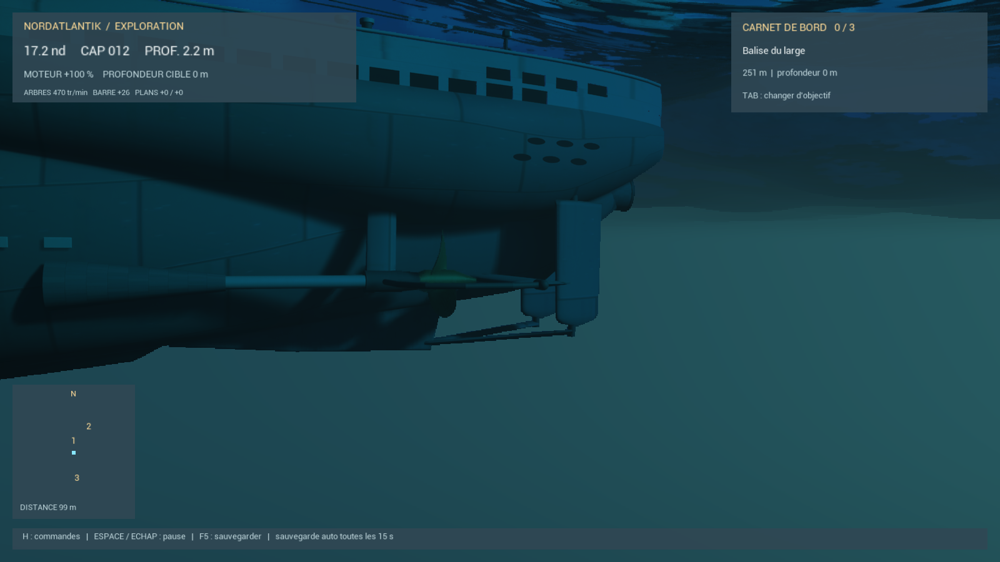
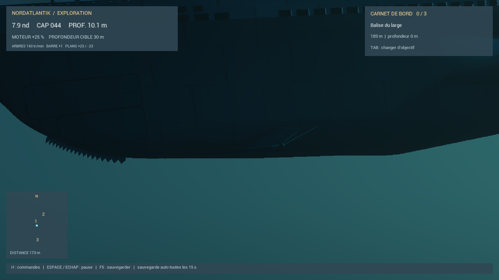

# Organes mobiles du VIIC

La carte jouable utilise une représentation articulée : coque, deux hélices, deux gouvernails, paire de barres avant et paire de barres arrière. Les pièces proviennent du modèle Swift actuel, exportées séparément autour de leurs axes d’origine. Aucune pale ne se déforme : chaque hélice tourne comme un ensemble rigide.

L’ancien maillage et son corps physique restent conservés. La représentation articulée s’y attache sans collision supplémentaire et sans changer sa masse, ses flotteurs ou son centre de gravité. **V** alterne les deux représentations pour comparaison. **G** passe de la caméra normale à une vue des hélices/gouvernails, puis des barres avant ; **C** revient à la navigation. Ces vues fonctionnent sous l’eau, où les pièces sont habituellement masquées depuis la surface.

Les arbres accélèrent et ralentissent progressivement ; la marche arrière inverse leur rotation après passage par zéro. En avant, le haut de chaque hélice tourne vers l’extérieur. La propulsion suit désormais ce régime progressif. Les deux gouvernails travaillent ensemble, sur leurs mèches verticales, avec un débattement progressif dont le braquage effectif pilote le virage. Les barres avant et arrière réagissent à l’écart de profondeur et à la vitesse verticale, avec des incidences opposées pour donner l’assiette de plongée ou de remontée. Leur incidence s’inverse en marche arrière et revient vers le neutre à profondeur stabilisée. La plongée demeure assistée, avec une assiette limitée à huit degrés.

## Référence et approximations

Le [manuel du Type VIIC](https://uboatarchive.net/Manual/Manual.htm) donne un maximum de 33° pour les gouvernails en commande électrique (35° en manuel), 30° dans les deux sens pour les barres avant, et 25° vers le haut / 35° vers le bas pour les barres arrière. Il décrit aussi la rotation des hélices vers l’extérieur et un régime diesel nominal de 470 tr/min. Les commandes normales des barres sont ici limitées à 25°, à l’intérieur de ces butées.

Les vitesses de servomoteur retenues (5°/s pour les gouvernails, 6°/s pour les barres), l’accélération des arbres (65 tr/min par seconde), le plafond électrique de 280 tr/min et les gains d’asservissement sont des réglages de jeu. Ce n’est pas une reproduction intégrale des transmissions, de la commutation diesel/électrique ni de l’hydrodynamique. L’échantillonnage des images peut produire un effet stroboscopique sur les pales rapides ; leur régime calculé n’est pas artificiellement ralenti.

## Reconstruction

1. `zsh Tools/export-articulated.sh` depuis le dossier UnrealDemo (Metal requis).
2. `python3 Tools/split-articulated.py` : séparation sans omission ni duplication de faces et génération des pivots pour le module C++.
3. Lancer `Content/Python/import_articulated.py` dans Unreal ; seuls les nouveaux assets `/Game/Voyage/Articulated` sont enregistrés. Les dimensions de chaque pièce sont vérifiées après conversion de coordonnées ; Unreal retire certains triangles dégénérés.
4. Recompiler NordatlantikDemoEditor. Aucune reconstruction de carte n’est nécessaire.

Tests des commandes mécaniques : `Tests/gear-dynamics.cpp`. Essai Unreal : argument `-VoyageGearTest`, avec sauvegarde de test distincte. Les périscopes, trappes et armements ne sont pas automatisés par ce changement : ils ne constituent pas des gouvernes de manœuvre.

## Vues de contrôle

